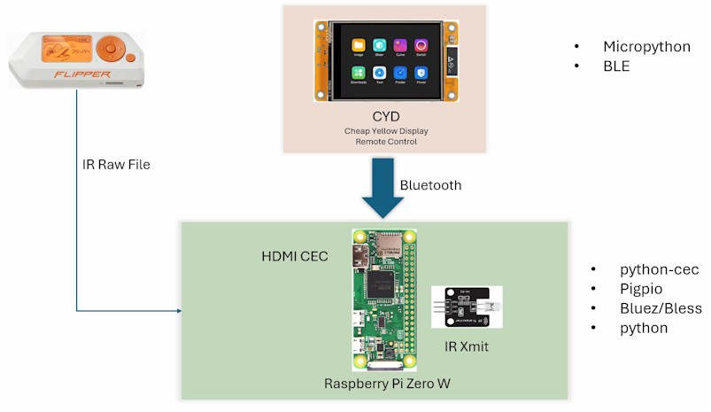

# PiRemote
This project covers the software used to create a Entertainment system remote control that manages both HDMI CEC and IR connectivity. It uses a Raspberry Pi Zero that communicates with a remote client using Bluetooth connectivity.

The remote client is built on a CYD (Cheap Yellow Display) device and exposes the most useful functions (for me) for managing my entertainment system (TV, Reciever, Blueray, Cable box, Firestick, Chromecast)



# Setup
## Raspberry PI Zero
OS : Raspberry OS 32 Bit Lite - Bookworm based release.

Set up the raspberry pi to have network connectivity and a host name. Use pi as the user.

### Samba (SMB) ###

I mainly use Samba(SMB) to set up a mapped file share to the raspberry pi to allow VSCode to run on windows and edit the files in the share on the Raspberry pi. VSCode Remote SSH is not an option on a Raspberry Pi Zero. 
```
sudo apt update 
sudo apt install samba samba-common-bin -y
```
Edit the samba config file, add the following text at the end
```
sudo nano /etc/samba/smb.conf
```
```
[PiShare]
path = /home/pi
writeable = yes
create mask = 0775
directory mask = 0775
public = no
```
Set up a smb password for the pi user
```
sudo smbpasswd -a pi
```
Restart the samba service
```
sudo systemctl restart smbd
```
### CEC Libraries###

This sets up a CLI client to work with CEC and a python interface to CEC

[CEC python library](https://github.com/trainman419/python-cec)
```
sudo apt-get update
sudo apt-get install libcec-dev build-essential python3-dev 
sudo apt install python3-pip –y
pip install cec --break-system-packages 
```
[CEC Client](https://pimylifeup.com/raspberrypi-hdmi-cec/
) 
```
sudo apt install cec-utils
```
CLI examples
```
echo 'scan' | cec-client -s -d 1
cec-client -m 
```
### pigpio ###

```
sudo apt update
sudo apt install python3-setuptools
wget https://github.com/joan2937/pigpio/archive/master.zip
unzip master.zip
cd pigpio-master
make
sudo make install
```
Start the pigpiod demon on RPI startup using systemd
```
 sudo nano /etc/systemd/system/pigpiod.service
```
Add the following lines to the file
```
[Unit]
Description=Daemon required to control GPIO pins via pigpio
After=network.target

[Service]
Type=forking
ExecStart=/usr/local/bin/pigpiod -l
ExecStop=/bin/systemctl kill -s SIGKILL pigpiod
Restart=always

[Install]
WantedBy=multi-user.target

```
Restart the systemd services and start the pigpiod demon service
```
sudo systemctl daemon-reload
sudo systemctl enable pigpiod.service
sudo systemctl start pigpiod.service

```
Add this line to \boot\firmware\config.txt to set the gpio pin 22 to output and a low value. This insures the IR LED is turned off when the RPI starts up.
```
sudo nano /boot/firmware/config.txt
gpio=22=op,dl
```
### Bluetooth ###
Install the bless library for python to allow control of bluetooth.

```
sudo apt install python3-pip 
python3 -m pip install bless --break-system-packages
sudo apt install --only-upgrade bluez -m 
```


